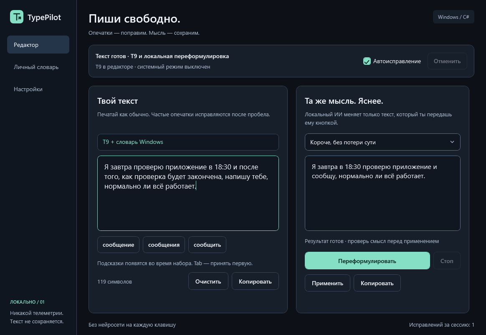

# TypePilot

Локальный помощник набора для Windows 11: исправления в стиле Т9, подсказки слов и переформулировка текста по отдельной команде.




Рабочий экспериментальный MVP. Универсальная поддержка всех полей Windows не заявляется: интеграция разрешает только проверяемые текстовые элементы и отказывается от изменения текста, если контекст неизвестен.

## Принципы

- Набор и словарь работают без нейросети и интернет-сервиса.
- Переформулировка по команде получает выделенный текст и показывает предпросмотр. Отдельно включаемый контекстный автокорректор получает текущий абзац локально и автоматически меняет только регистр, пробелы и пунктуацию.
- Никакой автоматической отправки сообщений, журналов нажатий или облачной телеметрии.
- Поля паролей, терминалы, редакторы кода и игры исключаются из системной интеграции.
- Любое автоисправление должно иметь безопасную отмену.

## Технологии

C# / .NET 10, WPF, отдельное ядро коррекции и тесты без стороннего тестового раннера. Локальный ИИ: совместимый с llama.cpp HTTP-интерфейс на loopback, опциональная переносимая модель вне репозитория.

## Что работает

- Встроенный редактор: исправления после пробела, подсказки слов, последовательный выбор Tab, Backspace сразу после исправления — отмена.
- Частые опечатки и ошибочная раскладка заменяются автоматически; нечёткие совпадения требуют явного выбора. Русский и английский словари Windows расширяют предложения, если установлены соответствующие языковые компоненты.
- Личный словарь и TXT импорт/экспорт, без незаметного сохранения переписки.
- Четыре режима ИИ с предпросмотром, отменой запроса и ручным применением/копированием результата. Лимит запроса 4000 символов.
- Фоновый Т9: автоисправления после пробела и подсказки рядом с полем в разрешённых приложениях. Проверяются Win32 Edit/RichEdit и доступные редактируемые поля UI Automation. Совместимость определяется конкретным полем, а не названием приложения.
- Корректные слова сначала проверяются, а не заменяются похожими. Короткий сленг не получает случайных исправлений; неизвестные слова можно оставить как есть или добавить в личный словарь.
- Подсказки не забирают фокус. Один / два / три Tab выбирают вариант 1 / 2 / 3. После паузы 600 мс выбранное слово вставляется; Escape или продолжение ввода отменяют отложенный выбор. Ctrl+Alt+1/2/3 и щелчок принимают сразу.
- Заглавная буква в начале предложения, исправление пробелов перед знаками и после `, ; ! ?`, двойной пробел в конце текста → точка и пробел. Фоновые лёгкие правки после паузы от 500 мс; курсор сохраняется естественным завершением вставки. Все функции отключаются отдельно.
- Имена и компании из канонического списка сохраняют нужный регистр: например, `GitHub` и `Алексей`. Список редактируется в настройках.
- Опциональный **контекстный автокорректор**: после паузы от 1,5 с локальный ИИ расставляет смысловые запятые, регистр и пробелы в слитных словах. Текущий абзац — до 600 символов, только если курсор в его конце. Набор, смена поля и перемещение курсора отменяют старую правку. Ответ с изменёнными буквами, цифрами или значимыми деталями отбрасывается. Пунктуация и границы слов всё равно могут быть неоднозначными.
- Случайная раскладка проверяется во всей недавней фразе (до 600 символов), в том числе по системному словарю Windows. Перевод настоящего английского не включён в этот режим.
- Ctrl+Alt+Space: **выделенный** текст сразу переформулируется в небольшом окне ИИ. «Заменить в поле» возвращает ответ только после подтверждения и проверки неизменности поля/выделения/текста. При отказе — ручное копирование.
- Ctrl+Alt+Backspace: отменить системное исправление, только если поле, курсор и текст ещё совпадают.

## Запуск из исходников

Требуется Windows 11 x64 и .NET SDK 10.0.401. Visual Studio, Python и Docker не нужны.

```powershell
./tools/build.ps1
./tools/run.ps1
```

`run.ps1` также обнаруживает SDK в `F:/DevTools/dotnet`. В иной папке задайте `DOTNET_ROOT_X64`. Настройки хранятся в `data/settings.json` возле exe и исключены из Git. Закрытие окна сворачивает приложение в трей; выход — через меню значка.

`./tools/publish.ps1` создаёт переносимую папку `artifacts/TypePilot-win-x64`. Для неё отдельная установка .NET не нужна: запускайте `TypePilot.exe`, сохраняя все соседние DLL и папки. Модель и движок ИИ устанавливаются отдельно; сама переносимая папка не включает их. Сборка без цифровой подписи, защиту Windows отключать не нужно.

## Локальный ИИ

```powershell
./tools/setup-ai.ps1
```

Скрипт скачивает на F около 2,5 ГБ весов Qwen3 4B Q4_K_M и примерно 33 МБ переносимого llama.cpp (Vulkan). Файлы проверяются по закреплённым SHA-256, существующие отличающиеся файлы не перезаписываются. Нужен совместимый Vulkan-драйвер GPU; на этом ПК проверена RTX 5060 Ti.

По умолчанию: `F:/DevTools/TypePilotAI`, loopback `127.0.0.1:17864`. Модель запускается по кнопке, Ctrl+Alt+Space или для контекстной проверки при включённом автокорректоре. Контекстный режим по умолчанию выключен: включается в «Настройки → Контекстный автокорректор». Общий движок использует 2 потока CPU и выгружается через 30 секунд простоя. Нет фонового Docker/службы. Запрос защищён временным ключом в памяти процесса; занятый неизвестным процессом порт приводит к отказу. Перенаправления и внешние адреса запрещены. Текст запросов в журнал не записывается. При генерации расход GPU/RAM заметен и может влиять на игру; загруженная Qwen3 4B занимает несколько ГБ памяти.

Проверка сохранения значимых деталей не доказывает полную смысловую эквивалентность. Всегда читайте результат: даже локальный ИИ может менять смысл, отрицания и стиль.

## Ограничения и безопасность

- Фоновый режим по умолчанию **включён** для разрешённых процессов. Ранее сохранённое выключенное состояние не переопределяется. Можно поставить на паузу на главной странице или через трей. Сначала проверьте на черновике.
- Никаких DLL-инъекций. Для необязательного выбора Tab временный клавиатурный хук включается только при видимой подсказке для проверенного поля; он не сохраняет символы. Tab с модификаторами и клавиши вне исходного окна/контрола проходят без перехвата. Смена фокуса снимает подсказку. Перед вставкой повторно проверяются поле, весь текст и курсор. Без подсказок Tab работает как обычно.
- Используются доступность Windows и ограниченный литеральный ввод, без доступа к буферу обмена. Нестандартные элементы, форматированный текст, IME и повышенные права могут мешать; не обещается работа во всех браузерах/мессенджерах/Office. Если выбор Tab недоступен, остаются Ctrl+Alt+1/2/3 и мышь.
- Автоматические правки работают при изменении текста, а не при простом фокусировании старого черновика. Пробелы и регистр — эвристики для обычной речи, не полноценная грамматическая модель. Проверяйте результат; необычные сокращения и форматирование могут требовать отключения отдельных функций.
- Поля паролей, неизвестный статус поля, приложения вне разрешённого списка, известные терминалы/редакторы кода/игры исключены. Нельзя считать это полноценной защитой всех секретов: не добавляйте чувствительные приложения в список.
- Набор не обучает профиль автоматически. Встроенный список завершения слов небольшой, не полноценная модель следующего слова.
- Текст редактора и ИИ-ответ живут в памяти и теряются при выходе. «Копировать» меняет буфер обмена только по нажатию пользователя. Программа никогда сама не отправляет сообщение. Для фонового Т9 в памяти кратковременно читается содержимое активного проверяемого поля (до 20000 символов). Если контекстный автокорректор включён, текущий абзац до 600 символов передаётся локальному движку; при выключенном режиме — только выделенный фрагмент по явной команде. История набора не хранится.

## Проверки

```powershell
./tools/build.ps1
./src/TypePilot.App/bin/Release/net10.0-windows/TypePilot.exe --ui-smoke
./src/TypePilot.App/bin/Release/net10.0-windows/TypePilot.exe --ai-smoke
./src/TypePilot.App/bin/Release/net10.0-windows/TypePilot.exe --field-smoke
```

Команда `--ai-smoke` требует установленной локальной модели и проверяет также реальные запятые, разделение слов и регистр имён на искусственных фразах. UI-проверка использует только собственное окно и искусственный текст; не управляет чужими приложениями. Отчёты и снимки — в `artifacts/qa`, не в Git. CI запускает офлайн-проверки и рендерит интерфейс; модель не скачивается на GitHub Actions.
Проверка `--field-smoke` использует только собственное синтетическое окно и требует интерактивной сессии. Если Windows не разрешает ему получить фокус, она пропускается без чтения и изменения чужих полей; это не означает успешную проверку интеграции. `tools/check-fields.ps1` проверяет свежесть отчёта и сообщает такой пропуск явно. Реальные приложения нужно тестировать отдельно на черновом тексте; `tests/browser-fixture.html` содержит локальные поля без сети и отправки сообщений.

## Разработка

Исходники публикуются небольшими проверяемыми изменениями. Модели, личный словарь, записи, локальные настройки и файлы сборки в Git не входят.

Список изменений: [CHANGELOG](CHANGELOG.md). Сторонние компоненты: [THIRD_PARTY](THIRD_PARTY.md).
